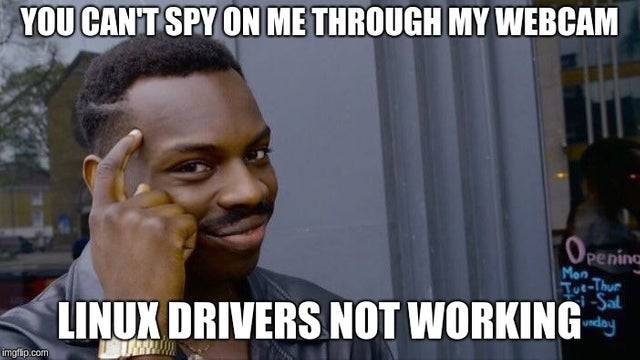

---
title: Linux-Workshop
author: "Some dudes"
date: \today
lang: de_DE
pandoc-latex-fontsize:
  - classes: [small]
    size: tiny
titlegraphic: img/Linux Mountains Wallpaper.png
...
\maketitle{}

# Was ist Linux und wer nutzt es? {.c}

::: columns

:::: column
\centering{}
Wer Linux nutzt in die Ecke

\begin{tikzpicture}[ultra thick]
\draw[latex-, line width=2mm] (0,0) --++(3cm,0);
\end{tikzpicture}

::::

:::: column
\centering{}

Die anderen in die andere Ecke

\hspace*{\fill} \begin{tikzpicture}[ultra thick]
\draw[-latex, line width=2mm] (0,0) --++(3cm,0);
\end{tikzpicture}
\hspace*{\fill}
::::

:::

# Linux im Vergleich zu anderen Betriebssysteme

1. Open Source

1. Privaty

1. Security

1. Freedom

1. Package Managers

# Open Source

- Der Komplette Kernel: <https://github.com/torvalds/linux>
- GPL lizensiert

# Privatsphäre {.c}
\centering{}
{ height=80% }

# Sicherheit

- Zum Linux Kernel haben contributed:
    - Red Hat
    - Die NSA
    - IBM
    - Google
    - Suse
    - Microsoft
    - Und viele andere, kompetente Menschen

- Quasi alle sicherheitskritischen Rechner laufen auf Linux (hoffentlich)

# Frei, wie in "freie Sprache" {.c}
\centering{}
{ height=70% }

# Paketverwaltung

## Warum?
- Software kann zentral installiert, konfiguriert und entfernt werden
- Software kommt aus vertrauter Quelle
- Abhängigkeiten werden automatisch mit installiert
- Nicht jedes Software muss ihren eigenen Updater mitbringen

## Package Manager

- Redhat based: `yum`, `dnf`
- Debian based: `apt`
- Arch based: `pacman`

# Linux im Studium

- RO (Programmieren auf Arm)

- SPP (Programmieren auf dem Lichtenberg Cluster)

- AER (Bluespec läuft nur auf Linux)

- Für viele andere Module ist die Installation und Nutzung
von Tools auf Linux deutlich einfacher.

    - TeX-Live
    - IntelliJ (eher Java)
    - SSH
    - Git
    - System Verilog

# Wie kann ich Linux testen/nutzen

- Auf altem Laptop installieren

- Virtuelle Maschinen

    - WSL

    - VirtualBox

    - VMware

    - $\vdots$

- Dual-Boot

- Im Anschluss Live booten
